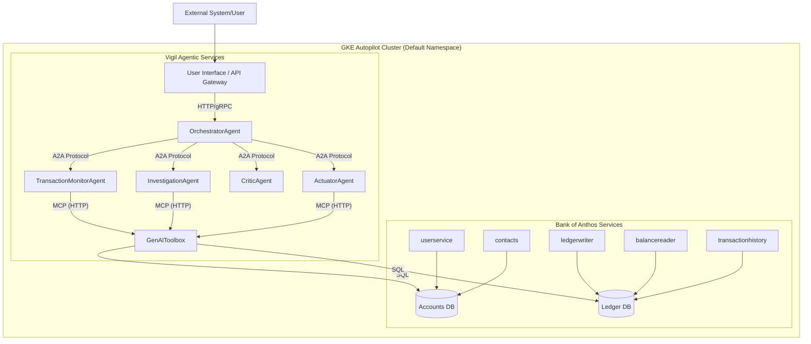

# Vigil AI Fraud Shield

**Vigil is a proactive, hierarchical multi-agent system designed to enhance the security of microservice-based financial applications. Built for the Google Kubernetes Engine (GKE) 10th Birthday Hackathon, Vigil integrates cutting-edge agentic AI capabilities to detect and mitigate financial fraud in real-time.**

## Project Overview

The mission of the Vigil System is to construct a proactive, hierarchical multi-agent system on GKE that enhances the Bank of Anthos application by detecting and mitigating financial fraud. This system leverages Google's agentic stack (ADK, MCP via GenAl Toolbox, A2A) to monitor transactions, analyze them for fraudulent activity, and take action to protect users' accounts.

## Architecture

The Vigil architecture is a sophisticated, decoupled, and secure Hierarchical Multi-Agent System. A central **Orchestrator Agent** manages the workflow, delegating tasks to specialized agents. The system interfaces with the Bank of Anthos application's databases through the **GenAl Toolbox**, which acts as a secure data access layer.

### Architectural Diagram



### Component Roles & Responsibilities

| Component                | Technology/Protocol       | Role & Responsibility                                                                                                                                                           |
| :----------------------- | :------------------------ | :------------------------------------------------------------------------------------------------------------------------------------------------------------------------------ |
| **Orchestrator Agent**   | ADK (LlmAgent)            | The system's central "brain." Receives high-level tasks, plans multi-step workflows, and delegates sub-tasks to specialized agents using the A2A protocol.                      |
| **TransactionMonitor Agent** | ADK (Loop or CustomAgent) | The system's sensor. Continuously monitors the Ledger DB for new transactions, flags anomalies, and initiates an investigation via an A2A call to the Orchestrator.            |
| **Investigation Agent**  | ADK (LlmAgent with Gemini) | The digital detective. Gathers comprehensive context on a flagged transaction using various database tools. Synthesizes findings into a "case file" for review.               |
| **Critic Agent**         | ADK (LlmAgent with Gemini) | The quality assurance layer. Receives the case file and adversarially challenges the initial suspicion to reduce false positives before any action is taken. A key innovation. |
| **Actuator Agent**       | ADK (CustomAgent)         | The enforcement arm. Receives validated commands from the Orchestrator and executes actions (e.g., locking an account) by invoking tools on the GenAl Toolbox.                   |
| **GenAl Toolbox Service**| GenAl Toolbox (Go binary) | The secure MCP server. Connects to both Bank of Anthos databases and exposes pre-defined SQL queries as "tools" for the agents to consume.                                       |

## Key Features

*   **Hierarchical Multi-Agent System:** A sophisticated architecture with specialized agents for monitoring, investigation, quality assurance, and action, all coordinated by a central orchestrator.
*   **Proactive Fraud Detection:** The system continuously monitors transactions and proactively identifies and mitigates potential fraud before it can cause harm.
*   **Adversarial Quality Assurance:** The innovative **Critic Agent** acts as a skeptical reviewer, challenging the findings of the Investigation Agent to reduce false positives and ensure high-quality analysis.
*   **Secure Data Access:** The **GenAl Toolbox** provides a secure bridge to the application's databases, exposing only the necessary data through a well-defined API.
*   **Seamless Integration:** The Vigil System interacts with the existing Bank of Anthos application through its APIs, demonstrating how agentic AI can enhance legacy systems without modifying their core code.

## Technology Stack

*   **Google Kubernetes Engine (GKE):** The deployment platform for the entire system.
*   **Google AI Models (Gemini):** Powers the intelligence of the Investigation and Critic agents.
*   **Agent Development Kit (ADK):** The toolkit used to build the agents.
*   **Model Context Protocol (MCP):** Used for communication between the agents and the GenAl Toolbox.
*   **Agent2Agent (A2A) protocol:** Facilitates communication and orchestration between the agents.

## Deployment Guide

Follow these steps to deploy the Vigil AI Fraud Shield to your GKE cluster.

### Prerequisites

*   `gcloud` CLI authenticated to your Google Cloud project.
*   `kubectl` configured to connect to your GKE cluster.
*   `docker` installed and running.
*   The Bank of Anthos application should already be deployed to your GKE cluster.

### 1. Configure the Gemini API Key

Create a Kubernetes secret for your Gemini API key.

1.  Copy the example file:
    ```bash
    cp vigil-system/gemini-api-key-secret.yaml.example vigil-system/gemini-api-key-secret.yaml
    ```
2.  Edit `vigil-system/gemini-api-key-secret.yaml` and replace the placeholder with your actual Gemini API key.

### 2. Create Artifact Registry Repository

Create a repository to store the container images.
```bash
gcloud artifacts repositories create vigil-repo \
    --repository-format=docker \
    --location=southamerica-east1 \
    --description="Repository for Vigil AI Fraud Shield images"
```

### 3. Configure Docker Authentication
```bash
gcloud auth configure-docker southamerica-east1-docker.pkg.dev
```

### 4. Build and Push Container Images

Run these commands from the root of the repository to build and push the images for each service.
```bash
# Define variables
export PROJECT_ID="vigil-demo-hackathon"
export REGION="southamerica-east1"
export REPO="vigil-repo"
export IMAGE_PREFIX="${REGION}-docker.pkg.dev/${PROJECT_ID}/${REPO}"

# Build and push images for each agent and the GenAl Toolbox
docker build -t "${IMAGE_PREFIX}/genal-toolbox:latest" -f vigil-system/genal_toolbox/Dockerfile .
docker push "${IMAGE_PREFIX}/genal-toolbox:latest"

docker build -t "${IMAGE_PREFIX}/transaction-monitor-agent:latest" -f vigil-system/transaction_monitor_agent/Dockerfile .
docker push "${IMAGE_PREFIX}/transaction-monitor-agent:latest"

docker build -t "${IMAGE_PREFIX}/orchestrator-agent:latest" -f vigil-system/orchestrator_agent/Dockerfile .
docker push "${IMAGE_PREFIX}/orchestrator-agent:latest"

docker build -t "${IMAGE_PREFIX}/investigation-agent:latest" -f vigil-system/investigation_agent/Dockerfile .
docker push "${IMAGE_PREFIX}/investigation-agent:latest"

docker build -t "${IMAGE_PREFIX}/critic-agent:latest" -f vigil-system/critic_agent/Dockerfile .
docker push "${IMAGE_PREFIX}/critic-agent:latest"

docker build -t "${IMAGE_PREFIX}/actuator-agent:latest" -f vigil-system/actuator_agent/Dockerfile .
docker push "${IMAGE_PREFIX}/actuator-agent:latest"
```

### 5. Deploy the Application

Apply the Kubernetes manifests in the following order:
```bash
# 1. Apply the Secret and ConfigMap
kubectl apply -f vigil-system/gemini-api-key-secret.yaml
kubectl apply -f vigil-system/genal_toolbox/toolbox-configmap.yaml

# 2. Apply the Deployments and Services for each component
# GenAl Toolbox
kubectl apply -f vigil-system/genal_toolbox/genal_toolbox_deployment.yaml
kubectl apply -f vigil-system/genal_toolbox/genal_toolbox_service.yaml

# TransactionMonitor Agent
kubectl apply -f vigil-system/transaction_monitor_agent/transaction_monitor_agent_deployment.yaml

# Orchestrator Agent
kubectl apply -f vigil-system/orchestrator_agent/orchestrator_agent_deployment.yaml
kubectl apply -f vigil-system/orchestrator_agent/orchestrator_agent_service.yaml

# Investigation Agent
kubectl apply -f vigil-system/investigation_agent/investigation_agent_deployment.yaml
kubectl apply -f vigil-system/investigation_agent/investigation_agent_service.yaml

# Critic Agent
kubectl apply -f vigil-system/critic_agent/critic_agent_deployment.yaml
kubectl apply -f vigil-system/critic_agent/critic_agent_service.yaml

# Actuator Agent
kubectl apply -f vigil-system/actuator_agent/actuator_agent_deployment.yaml
kubectl apply -f vigil-system/actuator_agent/actuator_agent_service.yaml
```

### 6. Verify the Deployment

Check the status of the pods to ensure they are all running correctly.
```bash
kubectl get pods
```

## Usage

Once deployed, the Vigil System will automatically begin monitoring the Bank of Anthos transactions. The end-to-end workflow for a typical fraud detection scenario is as follows:

1.  **Detection:** The **TransactionMonitorAgent** detects a high-value transaction and flags it.
2.  **Initiation:** The **TransactionMonitorAgent** sends an alert to the **OrchestratorAgent**.
3.  **Investigation:** The **OrchestratorAgent** delegates the investigation to the **InvestigationAgent**, which gathers details about the transaction and the user.
4.  **Critique:** The **OrchestratorAgent** sends the investigation findings to the **CriticAgent** for adversarial review.
5.  **Action:** If the **CriticAgent** concurs that the transaction is fraudulent, the **OrchestratorAgent** commands the **ActuatorAgent** to take action, such as locking the user's account.
